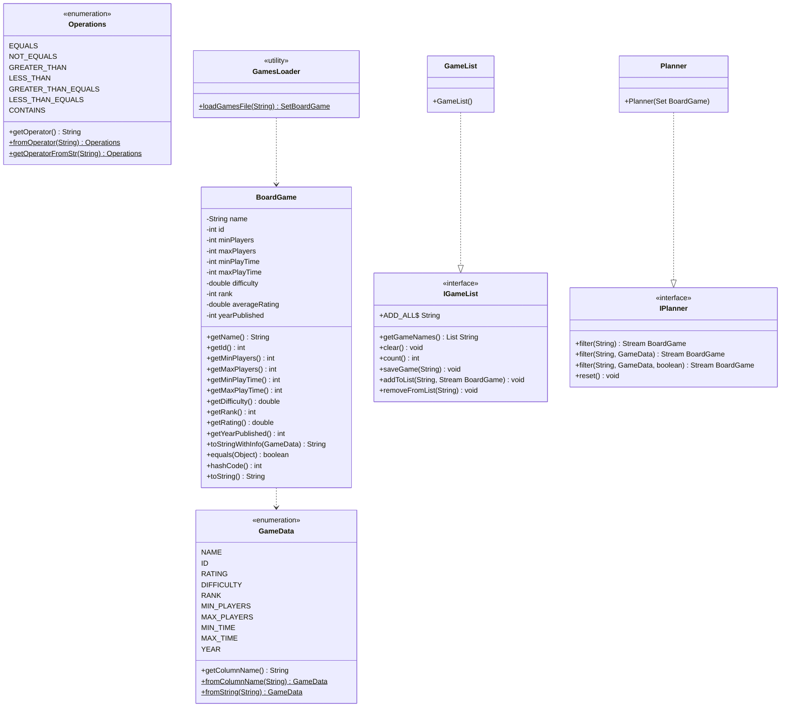
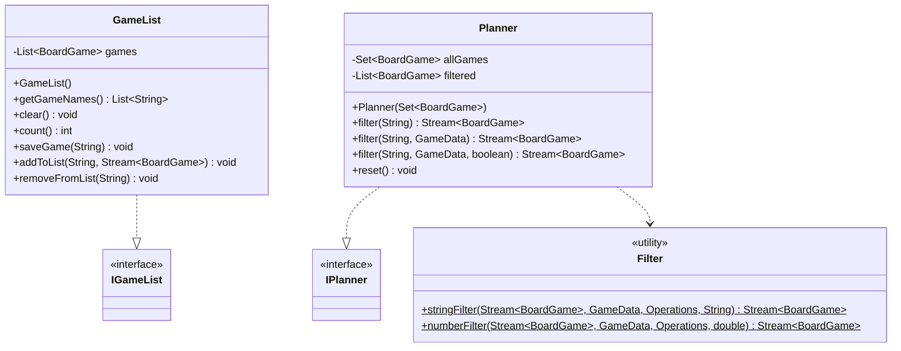
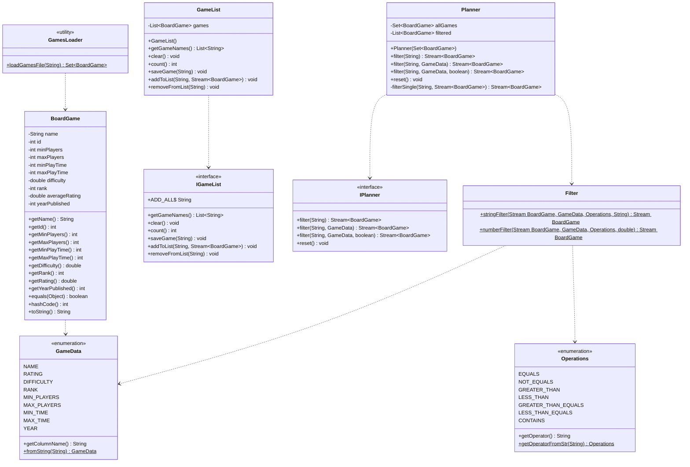

# Board Game Arena Planner Design Document

This document is meant to provide a tool for you to demonstrate the design process. You need to work on this before you code, and after have a finished product. That way you can compare the changes, and changes in design are normal as you work through a project. It is contrary to popular belief, but we are not perfect our first attempt. We need to iterate on our designs to make them better. This document is a tool to help you do that.

If you are using mermaid markup to generate your class diagrams, you may edit this document in the sections below to insert your markup to generate each diagram. Otherwise, you may simply include the images for each diagram requested below in your zipped submission (be sure to name each diagram image clearly in this case!)

## (INITIAL DESIGN): Class Diagram 

Include a UML class diagram of your initial design for this assignment. If you are using the mermaid markdown, you may include the code for it here. For a reminder on the mermaid syntax, you may go [here](https://mermaid.js.org/syntax/classDiagram.html)

### Provided Code

Provide a class diagram for the provided code as you read through it.  For the classes you are adding, you will create them as a separate diagram, so for now, you can just point towards the interfaces for the provided code diagram.

### Your Plans/Design

Create a class diagram for the classes you plan to create. This is your initial design, and it is okay if it changes. Your starting points are the interfaces.

## (INITIAL DESIGN): Tests to Write - Brainstorm

Write a test (in english) that you can picture for the class diagram you have created. This is the brainstorming stage in the TDD process. 

> [!TIP]
> As a reminder, this is the TDD process we are following:
> 1. Figure out a number of tests by brainstorming (this step)
> 2. Write **one** test
> 3. Write **just enough** code to make that test pass
> 4. Refactor/update  as you go along
> 5. Repeat steps 2-4 until you have all the tests passing/fully built program

You should feel free to number your brainstorm. 

#### GameList Tests

1. A new `GameList` starts with a count of 0 and an empty name list.
2. `addToList("all", filtered)` adds every game from the stream.
3. `addToList` with a game name adds only that game.
4. `addToList` with a number adds the game at that position.
5. `addToList` with a range adds games 1 through n.
6. `addToList` does not add duplicates.
7. `removeFromList("all")` clears the list.
8. `removeFromList` with a name removes only that game.
9. `clear()` resets count to 0.

#### Planner Tests

10. `filter("")` returns all games sorted by name.
11. `filter("name==Go")` returns only games with that exact name.
12. `filter("name~=go")` returns games whose name contains "go".
13. `filter("minPlayers>4")` returns only games with minPlayers > 4.
14. `filter("minPlayers>2,maxPlayers<6")` applies both conditions together.
15. Calling `filter` twice without `reset()` narrows results further.

## (FINAL DESIGN): Class Diagram

Go through your completed code, and update your class diagram to reflect the final design. It is normal that the two diagrams don't match! Rarely (though possible) is your initial design perfect.

For the final design, you just need to do a single diagram that includes both the original classes and the classes you added.

> [!WARNING]
> If you resubmit your assignment for manual grading, this is a section that often needs updating. You should double check with every resubmit to make sure it is up to date.

## (FINAL DESIGN): Reflection/Retrospective

> [!IMPORTANT]
> The value of reflective writing has been highly researched and documented within computer science, from learning to information to showing higher salaries in the workplace. For this next part, we encourage you to take time, and truly focus on your retrospective.

Take time to reflect on how your design has changed. Write in *prose* (i.e. do not bullet point your answers - it matters in how our brain processes the information). Make sure to include what were some major changes, and why you made them. What did you learn from this process? What would you do differently next time? What was the most challenging part of this process? For most students, it will be a paragraph or two.

My initial design was pretty close to what I ended up with but there were a few things I didn't fully think about at the start. The biggest change was how complex the filter string parsing turned out to be. I knew I needed to support operators like == and >=, but definitly didn't realize how tricky it'd be to split the strings, especially >= and <=. It made the the order of checks in getOperatorFromStr really important which also was a pain to work through. I also underestimated how much work removeFromList would be. I originally only thought by removing by name and "all" would work, but the interface also requires removing by number and range, and throwing exceptions for invalid input. Adding that later was a bit messy and I wish I had planned for it upfront.

The most challenging part was definitely the compounding filter logic in Planner. I had to keep track of the filtered list between calls and make sure reset() actually brought it back to the full set. I kept second guessing if it was actually working until I wrote tests that chained multiple filter calls together. The Filter utility class ended up being really helpful for keeping Planner working and the filterSingle method would have gotten way too long. If I did this again I'd spend more time thinking through all the edge cases before writing any code, instead of discovering them halfway through when the tests started failing.
